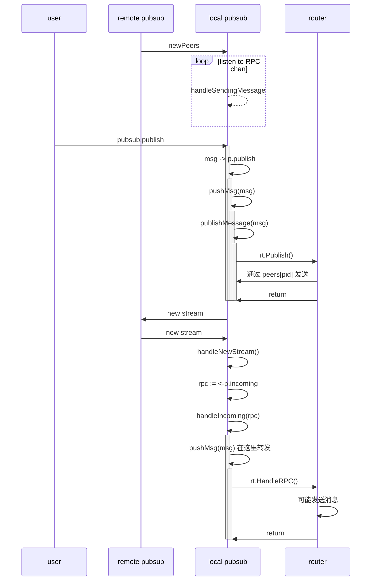
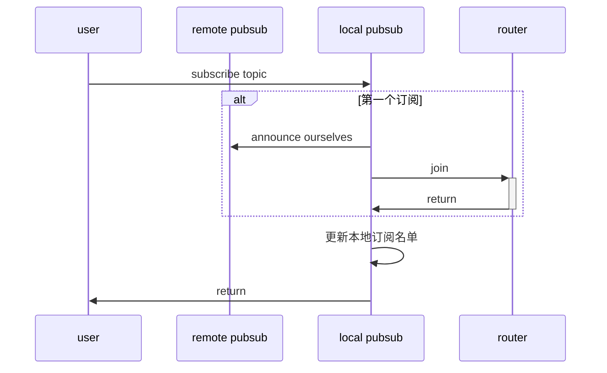
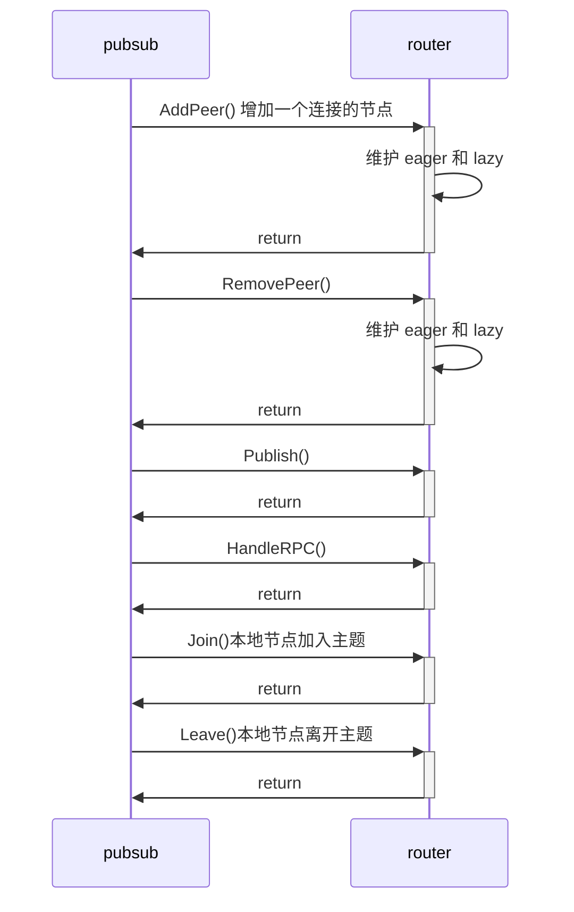
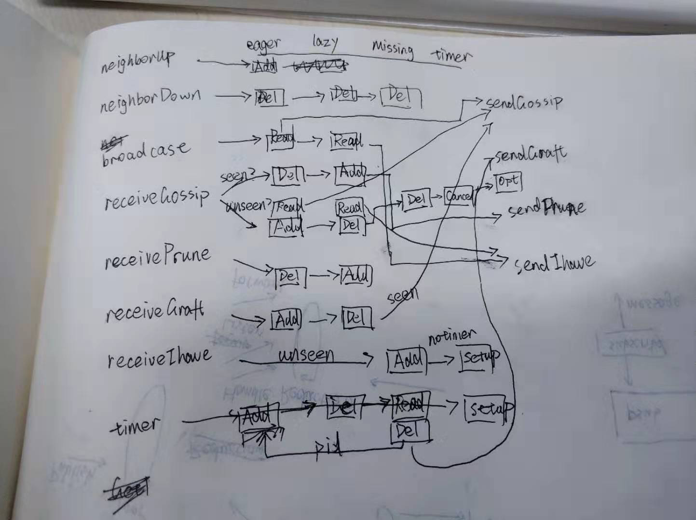
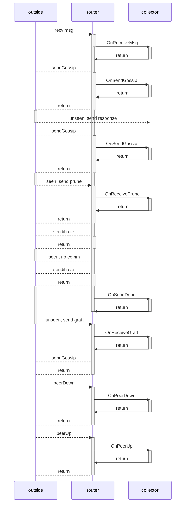

```
______  _                                _     
| ___ \| |                              | |    
| |_/ /| | _   _  _ __ ___   ___  _   _ | |__  
|  __/ | || | | || '_ ` _ \ / __|| | | || '_ \ 
| |    | || |_| || | | | | |\__ \| |_| || |_) |
\_|    |_| \__,_||_| |_| |_||___/ \__,_||_.__/ 
                                               
                                               
```


# pubsub  流程图


## pubsub 如何进行广播和转发


## 节点的加入和离开机制：


### plum 树的构建过程 (wip)





### hack in

除了树状的路由，我们需要知道某条信息的传播路径，以用来传播返回结果；

v0.1

我们把当前的 eager list，分成两部分：一部分是一个直接发送消息来的节点，这个节点我们会向它发送查询结果；另一部分是本地节点eagerPush 的其余节点，这些节点我们将监听它们发来的消息。

1. 由于发送消息（可能会改变eager list）和查询 eager list （读取 eager list）的时序不确定，我们需要对此进行同步；方法就是把读取的过程放入 eval 中。

2. 如何针对传入的 msg *pb.Message 查出那个直接发送的节点。 plumRouter 在 publish 函数被调用时，就已经确定了 msg 和 from 的一对一关系了，那么我们可以存储起这个关系，查询时返回即可。

3. 如何针对传入的 msg *pb.Message 查出要监听的节点集合。只有当我们知道这个集合，我们才能及时、快速地返回返回结果，而无须等待一定时间后才返回。在 v0.1 版本中，我决定直接返回查询时除了直接发送节点余下的 eager list。尽管这个集合和实际上对其发送信息的节点集合有所出入，但在网络稳定的情况下，这个集合基本不变，先作为近似解看看。

4. 同上一个问题，不过我们关注一下 msg 和 topic 的关系： 根据 proto, msg 和 topic 应该是一对多的关系；同一条信息可以投递到多个主题。但在 publish 函数中，msg 和 topic 又是一对一的关系。在 v0.1 版本中，我们先按一对一来处理，直接使用 msg 的第一个主题和它对应的单主题 router，返回在单主题路由中的 eager list.

v0.2

1. v0.1版本面临一个问题，就是并没有及时维护 listener 集合，导致在网络变化时，collector 不能及时地更新自己监听列表，导致最后不能及时返回，还会导致回收结果的丢失。我们打算在此基础上，增加一个事件驱动的 collector，提升 collector 的效率。

2. 初始的监听列表是怎样的？之后这个监听列表怎么变化？我们先遵循一个原则：向谁转发（查询请求），就准备监听谁（的返回结果）；谁向我们发，就把汇聚的结果发给谁。 在已经建立好广播生成树的情况下，监听列表和要发送返回结果的节点都在 eager list 里面；问题是在树结构发生变化的情况下，如何确定监听列表和要发送的节点？

3. 我们先不考虑解决方法，而应该先想办法测量由于树结构变化导致的返回结果丢失的问题究竟严不严重。预期是随着节点数量增多，丢失的可能性越大；

$$
接收率 = \frac{收包数量}{发包数量}
丢失率 = 1 - 接收率
$$

用接受率和节点的关系来衡量。 多次重复实验中，测出平均接收率、最小接受率、最大接收率；分单节点广播和多节点随机广播两者情况来实验。

还应该测量出广播回收机制跟占用带宽的影响。

4. 解决方法：把 router 改造成事件驱动型， 如下：



想法：
我们所有要接收结果的节点都在 eager list 和 lazy list 这两个集合，分别称为$E$和$L$。
我们要接收结果的集合是那些收到消息本体，并且之前没有看到过这个消息的节点结合，称为$T$。
由于发送导致树结构的变化，我们事先其实并不知道$T$,只能把$E$近似成$T$。
对于发送方，应该有办法确定$E$和$L$中每个节点是否会给当前节点返回结果，这样就能尽快地停止收集返回结果，从而加快整个查询的时间。
在我们确定不会再有新的包过来的时候，尽早地停止收集返回结果。我们知道，一条消息，**肯定**发送给 eager list 中的节点，**可能**发送给 lazy list 的节点。

**2019.11.25更新**

昨天和晓旻学长讨论，他也觉得多个节点同时查询导致的树结构剧烈变动，使得维护树结构不太可行。
目前他提出了可能的解决方案：
1. 使用结构化的网络，比如 kad, chord;
2. 使用通用的 pubsub，在存在重复接收的广播的基础上做回收。(目前这个方案比较可行)

方案 2 的实现路线：

目前我们有一个额外的 collector，最大的问题在于它的监听列表在收到消息之后不可改变。
首要任务：我们应该修改 collector，使得它能被外界更改监听列表；
然后，我们通过实现 tracer 接口，把相关的信息传入 collector。
在 collector 中，当收到DuplicateMessage时，我们需要额外发送消息，帮助发送节点进行剪枝。

**不过**，现在我们需要一个测量工具，帮我们测量回收过程中的丢包率。怎么测量呢？

测量工具的实现思路： 自动化模拟请求 + 日志分析 + 可视化

我们希望收集 PubSubCollector 在运行时所产生的日志文件，统计发送量和接收量。

具体怎么做？

我们有一个简单的 testRequest/testResponse，似乎可以帮助我们做测试；
模拟请求：
发送一个自增的 testRequest;
日志分析：
发送量：每当一条请求到达一个节点，当然会打印一条和 mid 有关的信息；我们在汇总时，统计相同 mid 的数量，即可获取某条信息的发送量
接收量：由于 testResponse 只是简单把所有 response 拼接在一起，我们可以在最终收到的 response 中，统计究竟收到多少个 response
可视化：
前端页面，到时找找有没有好用的库

**2019.11.27 更新**
昨晚和翔哥进行讨论，他也认为这个问题挺有价值的，提醒我说**除了回收率的指标外，还可以关注回收时间**，从这两个指标入手，搭建仿真平台进行实验。有没有可能**只有一部分节点的树在变化，而主干部分尽可能保持不变？**